# **End-to-End Untargeted Metabolomics Workflow**

I am learning by using this end-to-end workflow for LC-MS-based untargeted metabolomics experiments, conducted entirely within R using the Bioconductor ecosystem and base R functionality.

## ***Project Overview***

The samples were analyzed using ultra-high-performance liquid chromatography (UHPLC) coupled to a Q-TOF mass spectrometer (TripleTOF 5600+), utilizing hydrophilic interaction liquid chromatography (HILIC) for separation.

*Datasets used:*

 - LC-MS (MS1): Quantification of small polar metabolites in human
   plasma.
   
 - LC-MS/MS: Selected samples for feature identification and annotation.

*Experimental Design:*

 - Study Groups: Cardiovascular disease (CVD) patients vs. healthy
   controls (CTR).
 -  Samples: 3 CVD, 3 CTR, and 4 Quality Control (QC) samples.

 - Database Reference: MetaboLights MTBLS8735.

## **Step 1: Data Import**, organization and visualization

We extract the dataset from MetaboLights and load it as an MsExperiment object. This object acts as a container for both metadata and spectral data.

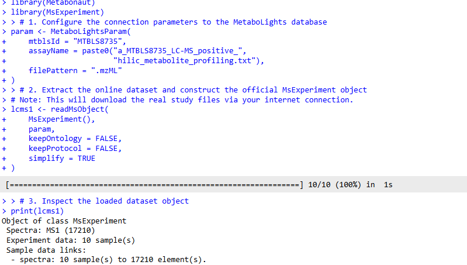

Raw .mzML files contain millions of data points. To improve efficiency, we configure parallel processing to split the workload across CPU cores.

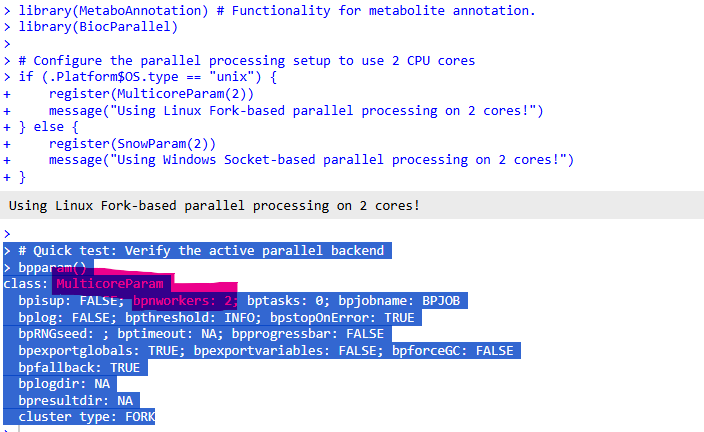

Metadata Sanitization
We extract the raw metadata, rename columns to human-readable formats (Sample, Type, Phenotype, Age), and integrate these into the lcms1 object.

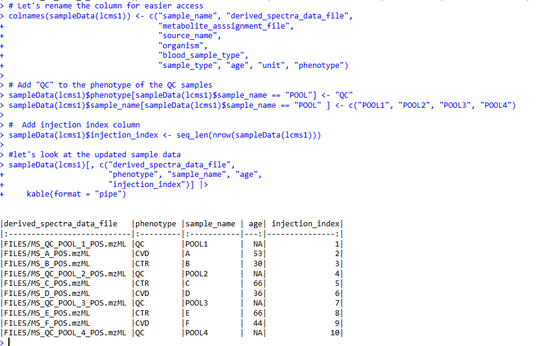

Visual Encoding
To ensure consistency across all downstream plots, we apply a global color mapping using the RColorBrewer package, assigning specific colors to QC, CVD, and CTR groups.

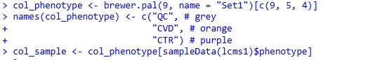

Spectral Inspection
The MS data is stored as a Spectra object. We inspect the metadata variables, including msLevel, rtime (retention time), precursorMz, and intensity.

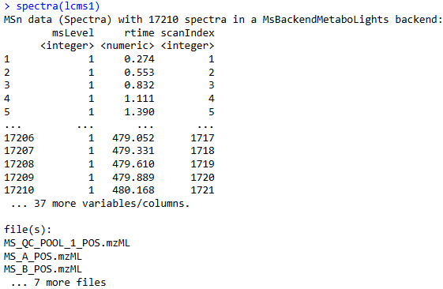

Refining the chromatogram 

BPC (Base Peak Chromatogram): Evaluates LC consistency.
TIC (Total Ion Chromatogram): Evaluates overall instrument sensitivity.

Effective visualization is paramount for assessing data quality. We used two internal standards:

First importing them both

Then plotting

we immediately notice clear concentration difference between QCs and study samples for the isotope labeled cystine ion. 
Also, the labeled methionine internal standard exhibits a signal amidst some noise and a noticeable retention time shift between samples.

## **Step 2 Data preprocessing**

3 major stages:

## *1- Chromatographic Peak Detection*

To achieve this, we employ the findChromPeaks() function within xcms.
The preferred algorithm in this case, CentWave, utilizes continuous wavelet transformation (CWT)-based peak detection .
It is an effective way in handling non-Gaussian shaped chromatographic peaks or peaks with varying retention time widths, which are commonly encountered in HILIC separations.

Below we apply the CentWave algorithm  for cysteine and methionine ions and evaluate the results

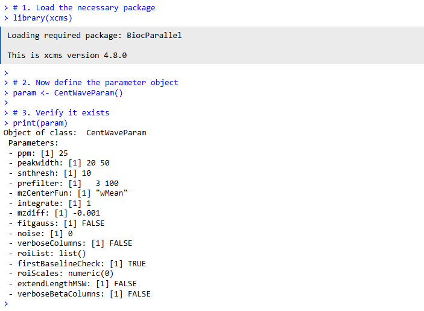

*peakwidth*: the minimal and maximal expected width of the peaks in the retention time dimension. dependent on the chromatographic settings 

*ppm*: The maximal allowed difference of mass peaks’ m/z values (in parts-per-million) in consecutive scans to consider them representing signal from the same ion.

*integrate*: the algorithm used to determine the peak boundaries. 

1 = assumes a symmetric, near gaussian peak shape while 
2 = determines the peak boundaries based on the observed intensities. 
We use integrate = 2 as it more accurately models non-symmetric chromatographic peaks with a longer right tail which are frequently observed in LC-MS data.

For this dataset the peak widths appear to be around 2 to 10 seconds. We choose a range that is not too wide or too narrow.

To determine the ppm, a deeper analysis of the dataset is needed. 
ppm depends on the instrument, 

Accurate determination of ppm : The following steps involve generating a highly restricted MS area with a single mass peak per spectrum, representing the cystine ion. The m/z of these peaks is then extracted, their absolute difference calculated and finally expressed in ppm

The following steps involve generating a highly restricted MS area with a single mass peak per spectrum, representing the cystine ion. The m/z of these peaks is then extracted, their absolute difference calculated and finally expressed in ppm.

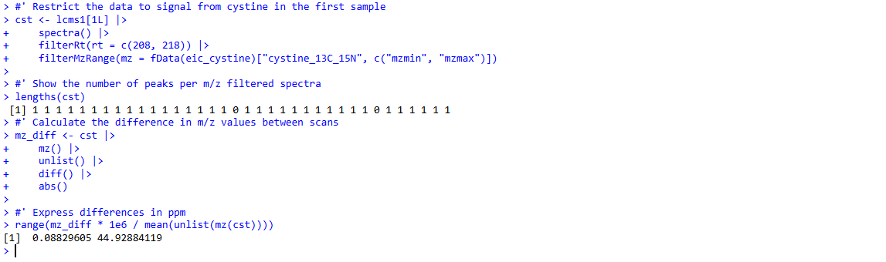

We therefore, choose a value close to the maximum within this range for parameter `ppm`, i.e., 15 ppm.

Now we have calibrated our parameters and we can perform the chromatographic peak detection on our EICs. 

there are three critical factors :

 *1. Retention Time Window Width***

Peak detection algorithms require sufficient "baseline" data points—the signal outside the peak—to accurately estimate background noise. If `findChromPeaks` fails to detect a feature in an EIC, the first troubleshooting step is to widen the retention time range of the EIC to capture more of the baseline.

*2. Adjusting the Signal-to-Noise Threshold (`snthresh`)*

When processing a whole LC-MS dataset, the algorithm has thousands of data points to calculate a robust noise level. Within a single, narrow EIC, that pool of data is much smaller. Consequently, you should often **reduce the `snthresh` value** for EICs to prevent the algorithm from prematurely rejecting real signals.

*3. Handling Sparse Data Points*

If peak appears "jagged" or consists of too few MS1 data points, the algorithm may struggle to model the peak shape. In such cases, setting `extendLengthMSW = TRUE` in the `CentWaveParam` object can help the algorithm extend the search area for wavelet scales, improving detection for sparser signals.

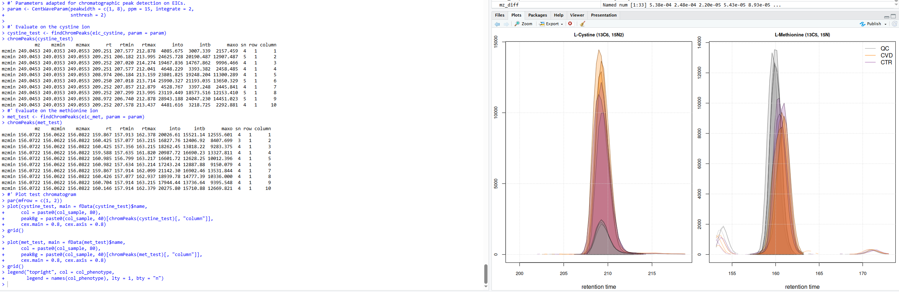

 - The columns `into` (integrated area) and `rt` (retention time) are  the primary quantitative outputs.  
   
 - There is a consistent `sn`(signal-to-noise) ratio across all 10 samples indicating that `CentWaveParam` configuration is stable and capturing the signal reliably.
 
moving from **targeted EIC-based tuning** to **global processing** of the entire LC-MS dataset. Reverting `snthresh` to the default is a professional choice, as the algorithm now has the full, statistically robust context of the entire run to distinguish peaks from noise.

**Global Chromatographic Peak Detection**

 - By applying `findChromPeaks()` to the `lcms1` object (the full dataset), `xcms` will now identify features across the entire experiment. 

 - The use of `chunkSize` is optimization, ensuring that memory usage remains stable even as your dataset scales.

Chromatographic peak detection on EICs after processing.

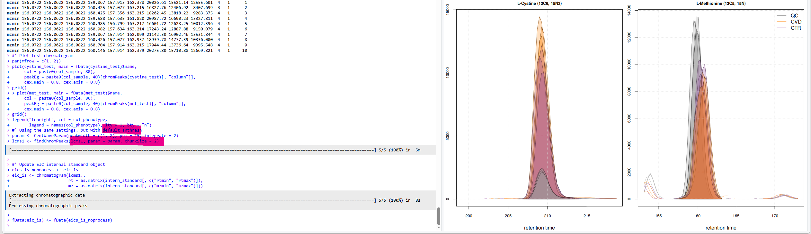

*conclusion*: Peaks were detected  in all samples for both ions indicates that the peak detection process over the entire dataset was effective.

***Refining Peak Detection Artifacts***

In complex LC-MS data, "peak splitting" is a common occurrence. This usually happens when the algorithm identifies a single chromatographic elution event as two distinct peaks due to a momentary dip in signal intensity (often caused for example by electronic noise or poor ionization efficiency).

Refining peak detection is a vital step in metabolomics, 
`refineChromPeaks` with `MergeNeighboringPeaksParam`, aims at merging such split peaks.moving beyond simple detection into structural data validation.

peak artefacts detection 

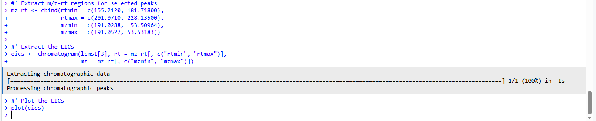

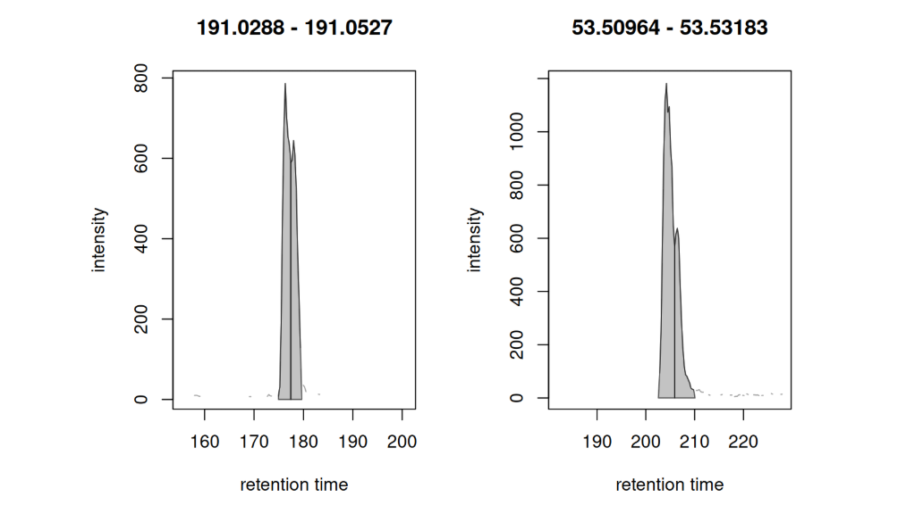

-   **`expandMz`:** we keep this very, very small. If too big, might accidentally grab a different isotope that belongs to a different molecule.
    
-   **`expandRt`:** 2.5 seconds before /after peak. That is about half the length of a normal peak,

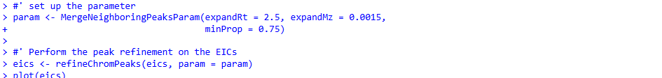

Examples of CentWave peak detection artifacts after merging

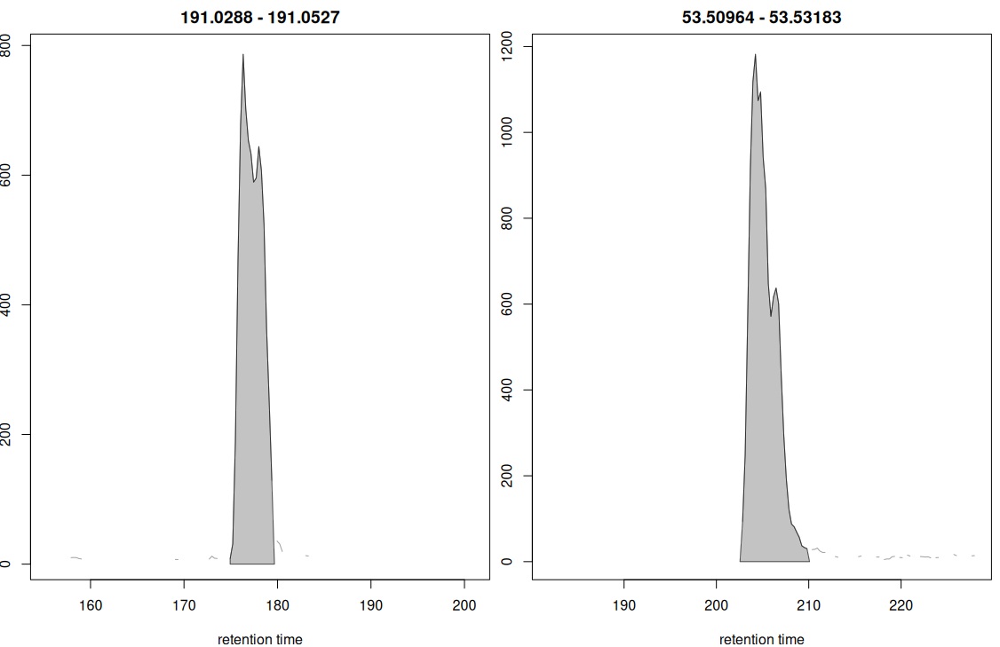

Therefore, we next apply these settings to the entire dataset. 
After peak merging, column `"merged"` in the result object’s `

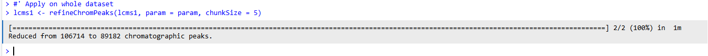

[chromPeakData((https://rdrr.io/pkg/xcms/man/XCMSnExp-class.html)` data frame can be used to evaluate which peaks in the result represent signal from merged, or from the originally identified chromatographic peaks.

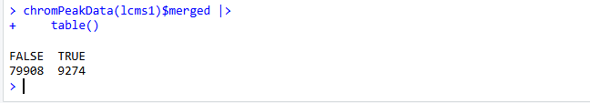

Before alignment we verify that your Internal Standards are consistently detected
 
By using `chromatogram()` to extract peaks based on`intern_standard` table, we are effectively "tagging" EICs with the refined peak data. = easier inspect of specific ions later.

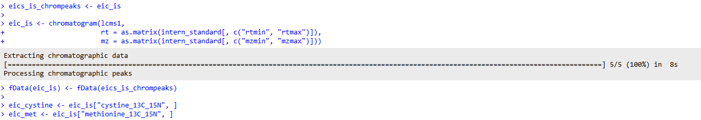

Evaluation of problematic samples 

Below we can see presentation of samples and number of identified chromatographic peaks.

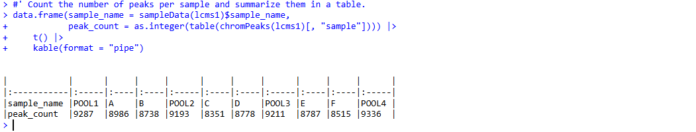

***Summary of chromatographic peak detection results per sample.***

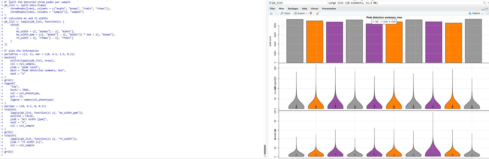

Summary of chromatographic peak detection results per sample.

***

## *2- Peak Retention Time (RT) Alignment*

Even with ideal instrument conditions, experimental random variations will cause the peaks RT to shift across the chromatogram.

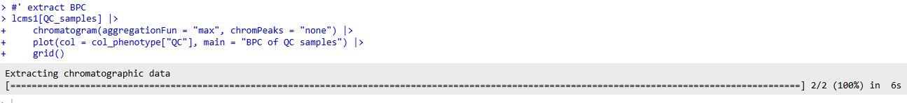

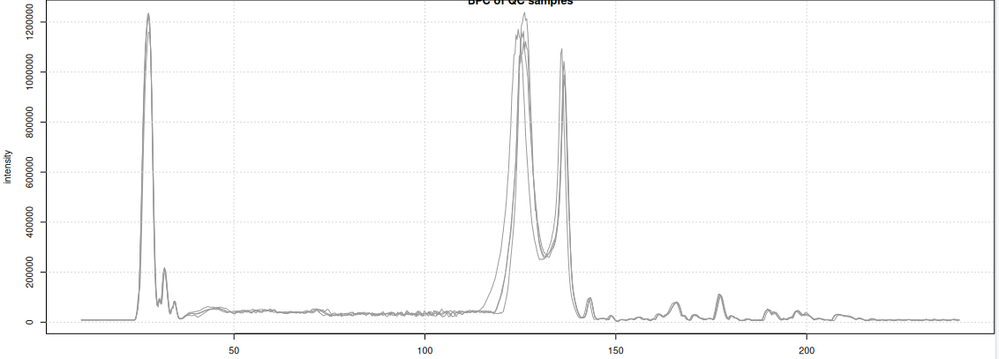

BPC of QC samples.

Theoretically, we proceed in two steps: first we select only the QC samples of our dataset and do a first alignment on these, using the so-called _anchor peaks_. In this way we can assume a linear shift in time, 

Despite having external QCs in our data set, we still use the subset-based alignment assuming retention time shifts to be independent of the different sample matrix (human serum or plasma) and instead are mostly instrument-dependent. _[xcms](https://bioconductor.org/packages/3.22/xcms)_ package.

For the initial correspondence, we use the _PeakDensity_ approach ([Louail et al. 2025](https://rformassspectrometry.github.io/Metabonaut/articles/a-end-to-end-untargeted-metabolomics.html#ref-louail_xcms_2025)) that groups chromatographic peaks with similar _m/z_ and retention time into LC-MS features. The parameters for this algorithm, that can be configured using the `PeakDensityParam` object, are `sampleGroups`, `minFraction`, `binSize`, `ppm` and `bw`.

-   `binSize`  and  `ppm`  define the required similarity of  _m/z_  values. 
    
-   High density areas are identified using the base R  `[density()](https://rdrr.io/r/stats/density.html)`  function, for which  `bw`  is a parameter: higher values define wider retention time areas, lower values require chromatographic peaks to have more similar retention times. 

This code effectively visualizes the **High Density Areas** (the black line) vs. the actual **Chromatographic Peaks** detected in the samples.

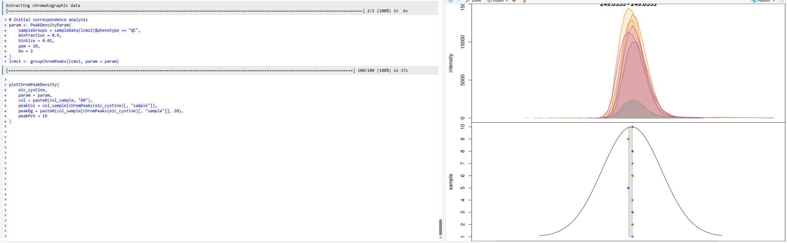

To optimize the `PeakDensityParam`, we performed a targeted visual inspection of _Cystine_. By setting `bw = 2` and `minFraction = 0.9`, we ensured that the peak grouping algorithm correctly identified the high-density retention time regions across all QC samples, creating a robust set of anchor peaks for subsequent alignment.

By basing thealignment on the **QC subset** using `PeakGroupsParam`, we will map how the peaks retention time drifted over time.
parameters used will be:

The parameters for this algorithm are:

-   `subsetAdjust`  and  `subset`: Allows for subset alignment. Here we base the retention time alignment on the QC samples, i.e., retention time shifts will be estimated based on these repeatedly measured samples.  `

-  To align the samples, we need "anchor peaks"—peaks that are unambiguously present and identifiable across the samples.`minFraction` sets the stringency for these anchors. If we set `minFraction = 0.9`, a feature must be detected in at least 90% of the QC subset to be considered a "trustworthy" anchor. 
    
-   `span`: Not all RT shifts are linear. Sometimes the drift happens more aggressively at the beginning of the chromatogram than at the end. To correct this, we use **LOESS (Locally Estimated Scatterplot Smoothing)** regression.

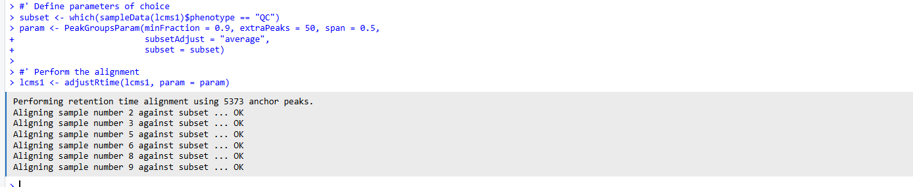

Once the alignment has been performed, the user should evaluate the results using the `[plotAdjustedRtime()](https://rdrr.io/pkg/xcms/man/plotAdjustedRtime.html)` function.

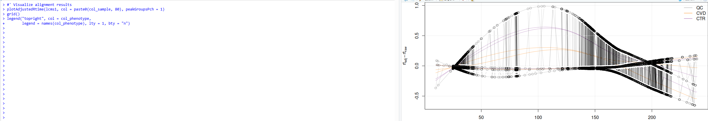

Retention time alignment results. There is only a small retention time shift since all samples were measured within the same measurement run.

We can also compare the BPC before and after alignment. To get the original data, i.e. the raw retention times, we can use the `[dropAdjustedRtime()](https://rdrr.io/pkg/xcms/man/XCMSnExp-class.html)` function:

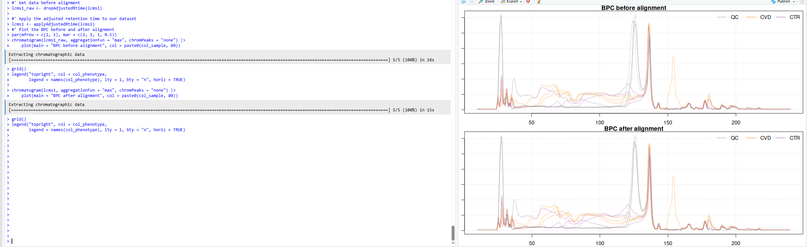

BPC before and after alignment.

We notice that the largest shift can be observed in the retention time range from 120 to 130s.  Apart from that retention time range, only little changes can be observed.

Evaluating the impact of alignment on the **Internal Standards (IS)** .

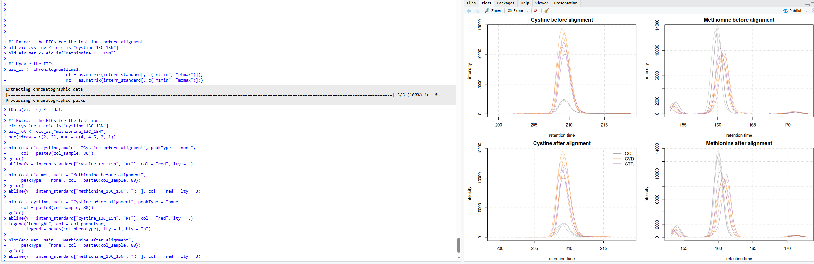

EICs of cystine and methionine before and after alignment.

We conducted a targeted inspection of internal standards (e.g., Cystine and Methionine). While the alignment impact on Cystine was subtle , the improvement in Methionine was obvious
    
we performed a statistical audit using the **MetaboAnnotation** package.
    
    -   **Matching:** we used `matchValues()` with `MzRtParam` to objectively isolate peaks within a strict 50 ppm (m/z) and 10-second (RT) window.
        
    -   **Filtering:** we applied `SingleMatchParam` to ensure only the highest-intensity peaks (`target_maxo`) were selected, effectively filtering out background noise.
        
-   the  `intern_standard_peaks` object acts as an index of high-confidence reference peaks across your entire sample set.
With parameters `mzColname` and `rtColname` we specify the column names in the query (our IS) and target (chromatographic peaks) that contain the _m/z_ and retention time values on which to match entities. We perform this matching separately for each sample. For each internal standard in every sample, we use the `[filterMatches()](https://rdrr.io/pkg/MetaboAnnotation/man/Matched.html)` function and the `[SingleMatchParam()](https://rdrr.io/pkg/MetaboAnnotation/man/Matched.html)` parameter to select the chromatographic peak with the highest intensity.

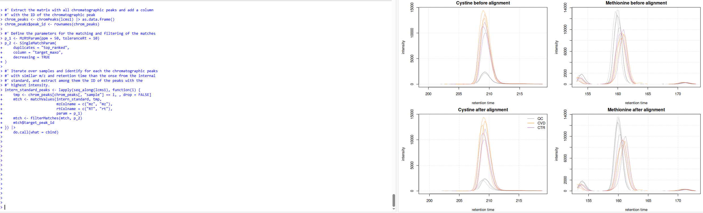

 We can now extract the retention times for these chromatographic peaks before and after alignment.
 
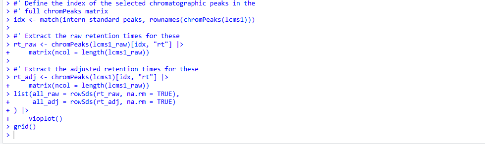

We can now evaluate the impact of the alignment on the retention times of internal standards across the full data set:

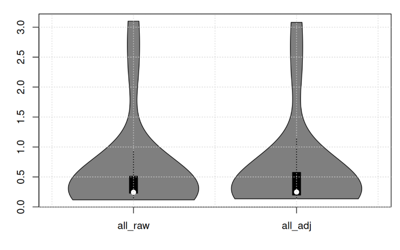

Retention time variation of internal standards before and after alignment.

Retention time alignment conclusion: Very slight reduction of the variation in retention times of I.S. by the alignment performed.

## *3- Correspondence (Grouping=Match features across different samples)*

using `plotChromPeakDensity()` to visualize the distribution of peak apexes across the samples

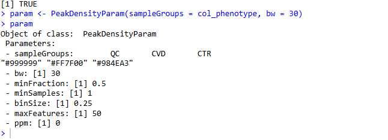

-   **`bw: 30`**: a 30-second window for grouping. This means if the same ion is detected in two different samples within 30 seconds of each other, the algorithm will attempt to group them together.
    
-   **`minFraction: 0.5`**: its meaning is a feature must be present in at least **50% of the samples**  to be kept as a "valid" feature. an effective way to prune noise/background ions that only appear in one or two samples.
    
-   **`binSize: 0.25`**: This is the $m/z$ tolerance. Any peaks within a 0.25 Da window will be considered candidates for the same metabolite.

`plotChromPeakDensity` using `eic_cystine` (the extracted ion chromatogram for a specific metabolite) to inspect how the grouping algorithm interprets the raw data.

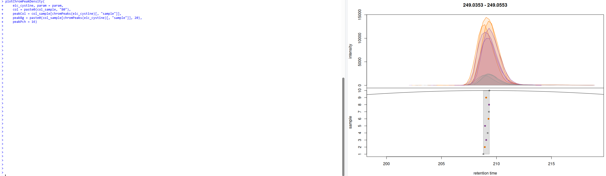

Initial correspondence analysis, Cystine.

-   **Top Panel (EIC):** This is the raw intensity. EIC signal for standards across all samples.
    
-   **Bottom Panel distribution**
    
    -   **The X-axis** is Retention Time.
        
    -   **The Y-axis** is Sample ID.
        
    -   **The vertical lines (or points)** represent where the algorithm "sees" the peak apex in each sample.
        
    -   **The Density Curve:** The shaded/colored line at the bottom shows the grouping probability.

-   **The Goal:** I want to see the filled circles (the apexes of the peaks in each sample) forming a tight vertical line.
 
Now, using`eic_met` 

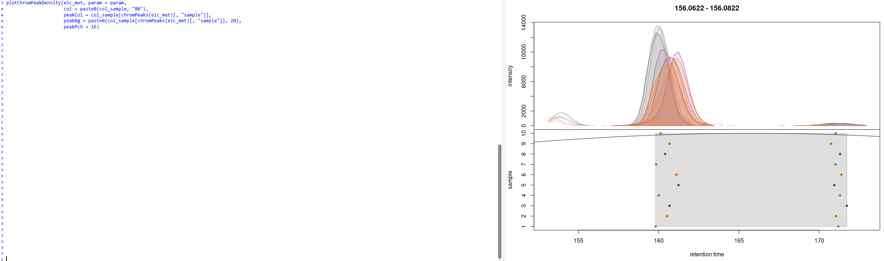

optimization:
-   **$bw = 30$:** I am telling the algorithm to look for peaks within a broad, 30-second neighborhood. In modern UHPLC-MS, where peaks are often narrow (fwhm < 5-10 seconds), this was too much. It was likely blending noise or overlapping peaks that should have remained distinct.
    
-   **$bw = 1.8$:** i am now forcing the algorithm to be highly specific. It will only group peaks that are extremely close in retention time.

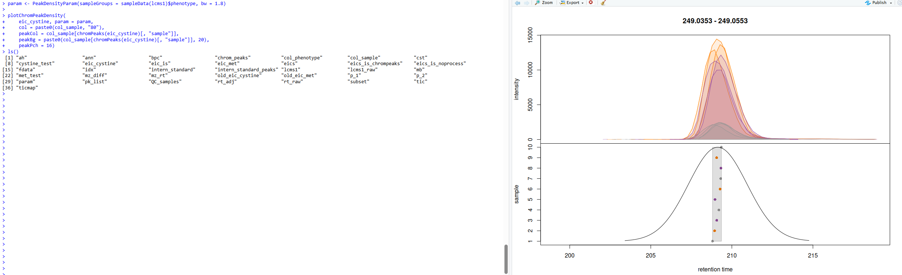

Correspondence analysis with optimized parameters, Cystine.

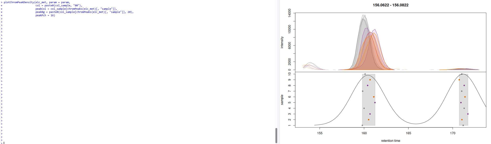

Correspondence analysis with optimized parameters, Methionine.

*peaks are now grouped more accurately into a single feature for each test ion. '

other important parameters optimized here such as

-   **`binSize = 0.25`**: By using a small $m/z$ bin, we are minimizing the chance of **peak overlap??** (where two distinct metabolites with slightly different masses are incorrectly merged into one).
    
-   **`ppm`**: Since we are on a TOF (Time-of-Flight) instrument, the error in mass measurement is not constant across the range. A `ppm` value (e.g., 10–20 ppm) provides a relative window, ensuring the algorithm is more forgiving for heavier, higher-$m/z$ ions where mass accuracy naturally fluctuates.
    
-   **`minFraction = 0.75`**:  noise filter?? It forces the algorithm to disregard "sporadic" peaks (peaks that appear in only 1 or 2 samples due to noise or contamination) and only retain features that appear consistently in at least 75% of a group.

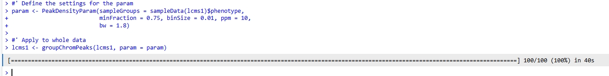

we will extract signal for an _m/z_ similar to that of the isotope labeled methionine for a larger retention time range. Importantly, to show the actual correspondence results, we set `simulate = FALSE` for the `[plotChromPeakDensity()](https://rdrr.io/pkg/xcms/man/plotChromPeakDensity.html)` function. 

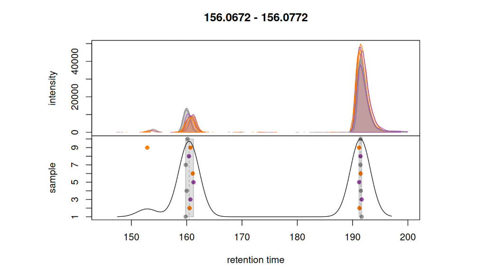

By setting `simulate = FALSE`, we are no longer asking the algorithm to calculate groupings based on a hypothetical parameter set; we are asking it to show you the **actual features** that were defined by the `groupChromPeaks()` process we just completed.

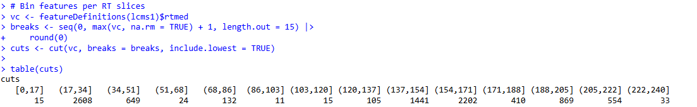

Another interesting information to look at the distribution of these features along the retention time axis.

*featureDefinitions(lcms1)* retrieves the summary table of all the features identified.

*$rtmed* specifically extracts the median retention time for every feature.

*vc* is now a vector containing a list of times (in seconds) for every feature found in samples.

a sequence of numbers from 0 to the maximum retention time found in data.

*length.out = 15*: This tells R to divide that entire time range into 15 equal segments (bins).

*round(0):* This makes the bin boundaries clean, whole numbers (e.g., 0, 17, 34...).

*breaks* is a vector of 15 "edges" that act as the boundaries for time slices.

The *cut()*  function looks at every individual retention time in vc and assigns it to one of the 15 bins defined by breaks.

*include.lowest = TRUE* ensures that a feature occurring exactly at time 0 is included in the first bin.

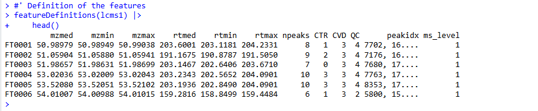

`featureDefinitions(lcms1)`, we are viewing the **master feature table**. Each row (`FTxxxx`) represents a chemical feature, and the columns provide the statistical coordinates for that feature:

-   **`mzmed` / `rtmed`**: The median mass-to-charge ratio and retention time across all samples, s
    
-   **`npeaks`**: The total count of peaks assigned to this feature. 
    
-   **`peakidx`**: A pointer to the underlying raw peaks. allows to go back from a feature to the specific raw signal it was built fr

The actual abundances for these features, which represent also the final preprocessing results, can be extracted with the `[featureValues()](https://rdrr.io/pkg/xcms/man/XCMSnExp-peak-grouping-results.html)` function:

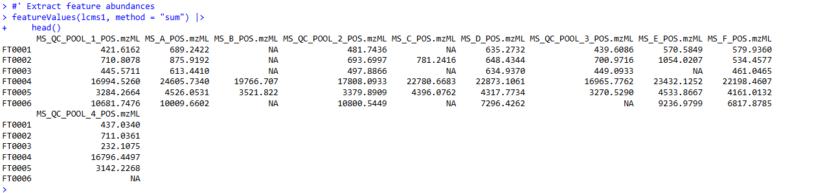

## *4- Gap filling*

By calculating the percentage of missing values, weare quantifying the **sparsity** of our dataset before we apply the `fillChromPeaks` function.

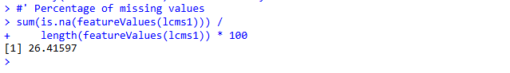

26 is  significant number of missing values values in our dataset.

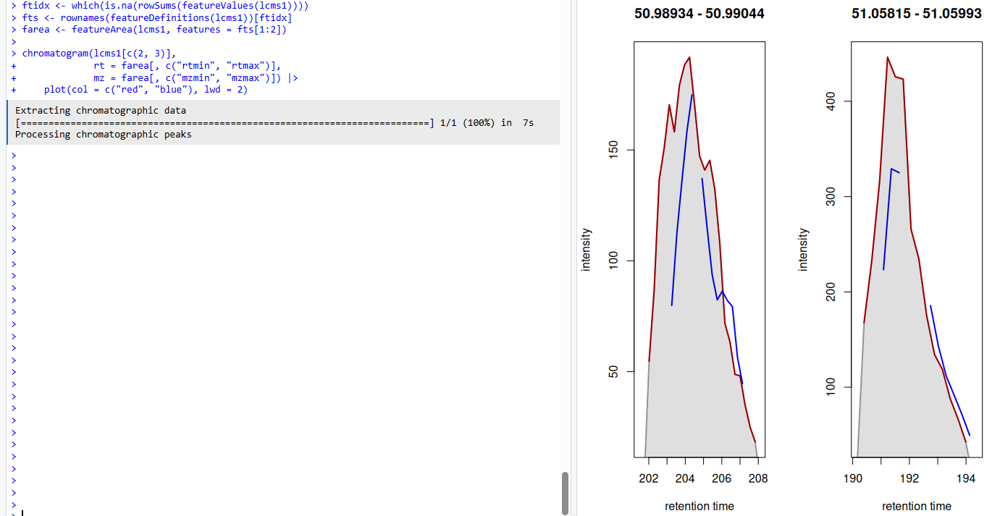

-   **`ftidx <- which(is.na(rowSums(featureValues(lcms1))))`**
    
    -   `featureValues(lcms1)` creates a matrix of abundances.
        
    -   `rowSums(...)` adds up the intensities for each feature across all samples.
        
    -   If a feature has even _one_ `NA` (missing value), the `rowSums` will result in `NA`.
        
    -   This line isolates the **indices** of every feature that has at least one missing value.
        
-   **`fts <- rownames(featureDefinitions(lcms1))[ftidx]`**
    
    -   This creates a list of the specific names (e.g., "FT0003") of the features that are incomplete.
        
-   **`farea <- featureArea(lcms1, features = fts[1:2])`**
    
    -   This grabs the "spatial coordinates" ($m/z$ and $RT$ boundaries) for the first two incomplete features in your list.

result: in both instances  a chromatographic peak was only identified in one of the two selected samples (red line), hence a missing value is reported for this feature in those particular samples (blue line).

the most likely reason peak detection failed is that the signal for this feature is very low, 

The `fillChromPeaks()` function effectively "bypasses" the threshold-based peak detection algorithm for the samples where the peak was missed.

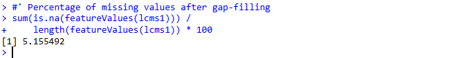

using the function with default parameters

Seeing that value drop to **5.%** indicates that the gap-filling process has effectively "rescued" most of the missing data in the data set

After gap-filling, also in the blue colored sample a chromatographic peak is present and its peak area would be reported as feature abundance for that sample.

we can also compare the intensity of peaks that were **automatically detected** vs. the intensity of peaks that had to be **"gap-filled".**

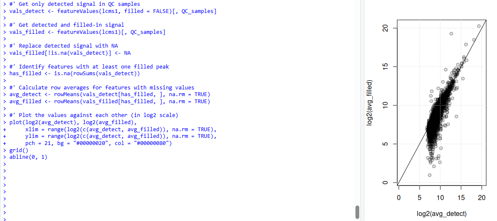
Detected vs. filled-in signal.

-   **`vals_detect`**: the peaks that the algorithm found without help.
    
-   **`vals_filled`**: These are the "rescued" signals.  The gap-filled data.
    
-   **The Plot**:
    
    -   **X-axis (Detected Intensity):** The average signal intensity for a feature in samples where it was clearly identified.
        
    -   **Y-axis (Filled Intensity):** The average signal intensity for that same feature in samples where it was initially missed.

observation: high correlation at high intensities and increased variance/lower values for gap-filled peaks at low intensities as expected

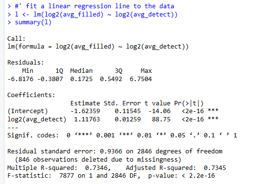

fitting of a linear regression 

The linear regression line has a slope of 1.12 and an intercept of -1.62. This indicates that the filled-in signal is on average 1.12 times higher than the detected signal.

## *4- Filtering features - missing values*

By removing features that appear only sporadically, we are shifting our focus from "all detected signals"to "biologically relevant features" (which appear consistently across experimental groups).

Such filter can be performed with `[filterFeatures()](https://rdrr.io/pkg/ProtGenerics/man/filterFeatures.html)` function from the _[xcms](https://bioconductor.org/packages/3.22/xcms)_ package with the `PercentMissingFilter` setting. The parameters of this filer:

-   **`threshold = 40`**: Since group size is 3, $1/3$ missing is 33.3%, which is less than 40%. A threshold of 40% allows for $1/3$ missing values. If it was set to 30%, it would be required for the peak to be present in all 3 samples (100% detection).
    
-   **`f`**: forcing `QC` to `NA`

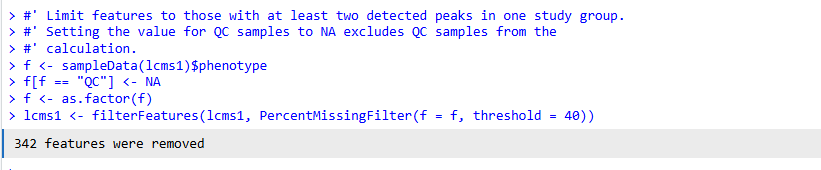

we apply the filter on the`"raw"`  assay of our result object, that contains abundance values only for detected chromatographic peaks 

If we filtered based on gap-filled data, you might keep a feature that is effectively just "filled-in noise" across all samples, which would give you false positives in your later statistical analysis.

## *5- Preprocessing results - archiving*

The final results of the LC-MS data preprocessing are stored within the `XcmsExperiment` object. The `[processHistory()](https://rdrr.io/pkg/xcms/man/XCMSnExp-class.html)` function returns a list of the various applied processing steps in chronological order. 

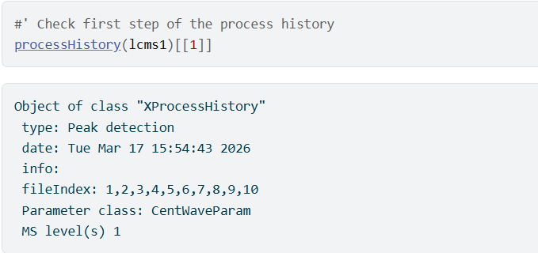
we extract the information for the first step of the performed preprocessing.

*The final result of the whole LC-MS data preprocessing is a two-dimensional matrix with abundances of the so-called LC-MS features in all samples.* 

at this stage of the analysis features are only characterized by their _***m/z_ and retention time*** and we don’t have yet any information which metabolite a feature could represent'

To conclude preprocessing we transfer our data into a `SummarizedExperiment` object and for **reproducibility and interoperability**.
-   **Encapsulation:** The `SummarizedExperiment` (SE) object is the standard container in the Bioconductor ecosystem.

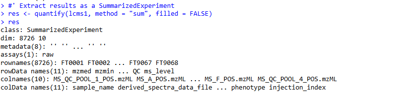

The `[quantify()](https://rdrr.io/pkg/ProtGenerics/man/protgenerics.html)` function takes the same parameters than the `[featureValues()](https://rdrr.io/pkg/xcms/man/XCMSnExp-peak-grouping-results.html)` function, thus, with the call below we extract a `SummarizedExperiment` with only the detected, but not gap-filled, feature abundances

`[sampleData()](https://rdrr.io/pkg/MsExperiment/man/MsExperiment.html)` are now available as `[colData()](https://rdrr.io/pkg/SummarizedExperiment/man/SummarizedExperiment-class.html)` (column, sample annotations) and the `[featureDefinitions()](https://rdrr.io/pkg/xcms/man/XCMSnExp-class.html)` as `[rowData()](https://rdrr.io/pkg/SummarizedExperiment/man/SummarizedExperiment-class.html)` (row, feature annotations).

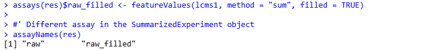

added the detected and gap-filled feature abundances as an additional assay to the `SummarizedExperiment`.

Feature abundances can be extracted with the `[assay()](https://rdrr.io/pkg/SummarizedExperiment/man/SummarizedExperiment-class.html)` function. 

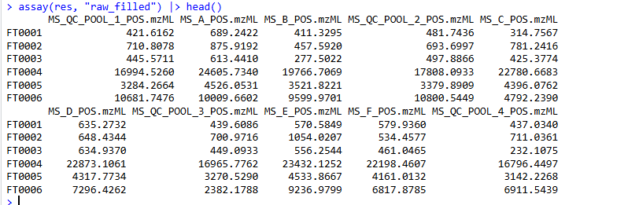

Saving the final state in a platform-independent format (`alabaster`) and it will be read from other languages like Python and Javascript as well as loaded easily back into R.

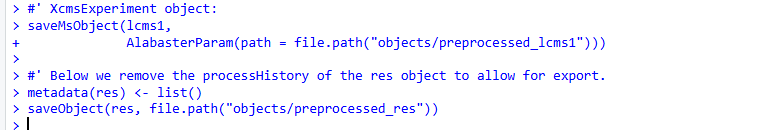

## **Step 3 Normalization**

We perform data normalization to strip away the bias so that the remaining variance is free from LCMSMS (mainly)a instrument drift, batch effects, and preparation errors .

### Approaches to Normalization

The choice of method depends entirely on the **source of the bias**:

**Sample Preparation**

Global intensity shift (all features affected)

Median Scaling, Quantile Normalization

**Instrument Drift**

Time-dependent trend (specific features affected)

LOESS, Linear Modeling (`adjust_lm`)

**Batch Effects**

Plate-specific offset

Batch correction (e.g., ComBat or linear modeling)

### 1. Initial quality assessment

By imputing the "below detection limit" and other missing values, we allow **mathematical algorithms like PCA** to run, while preserving the information including features that were for example , in fact, very low in abundance.

- 
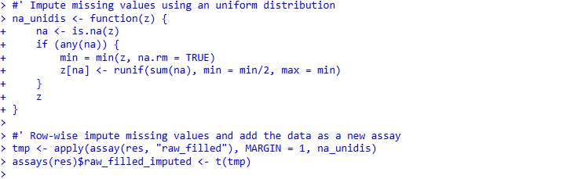

imputing missing value and adding the resulting data matrix as a new _assay_ to our result object.

then we use some transformation tools before the PCA: 

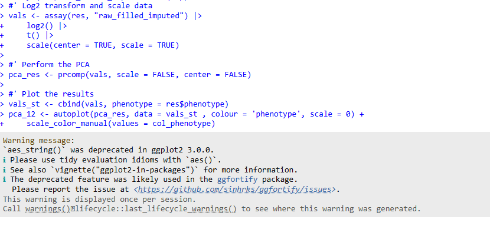

-   **Log2 Transformation:** due to for example many low-abundance features, a few very high-abundance ones Log2 squashes this distribution, making it "normal" enough for linear methods like PCA to handle.
    
-   **Centering:** Shifts each feature so its mean is zero
    
-   **Scaling:** Divides each feature by its standard deviation. This gives every metabolite an equal "vote" in the PCA, preventing high-intensity features from dominating the plot simply because they have larger numerical values.

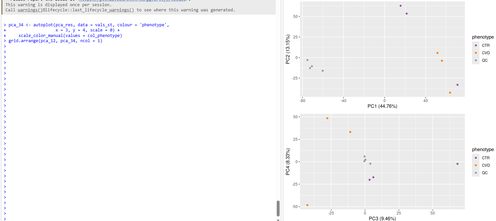
PCA of the data coloured by phenotypes. The PCA above shows a clear separation of the study samples (plasma) from the QC samples (serum) on the first principal component (PC1). The separation based on phenotype is visible on the third principal component (PC3). Also, QC pool samples are grouped closely together in the center of the plot, therefore the assay is stable.

**Intensity evaluation**

These visualizations confirm data is generally consistent, but there are specific technical biases—such as the median shift in those two CVD samples—that need to be addressed.

-   **Violin Plots:** By showing the density of log2 intensities, we verify that the **dynamic range** is comparable across the samples. 
    
-   **RLA Plots :**  RLA plots amplify small differences that aren't visible in raw abundance boxplots.
    
    - we seek all samples to have a median RLA of **0** (the dashed line).
        
    -   **Observation:** Since CVD samples are hovering away from the zero line they are deviant we need to normalize between to account for that
     
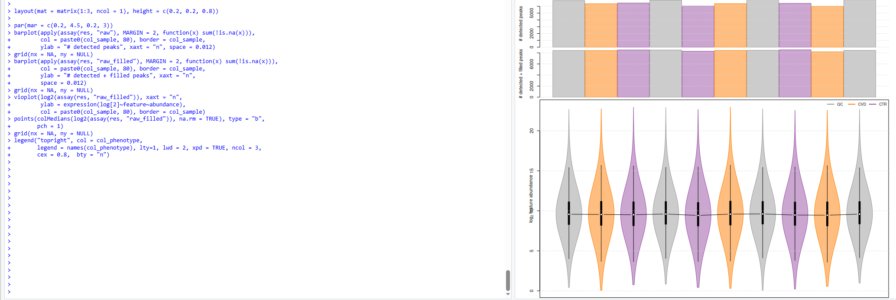

Number of detected peaks and feature abundances.

we can calculate and visualize within group RLA values using the `[rowRla()](https://rdrr.io/pkg/xcms/man/rla.html)` function from the _[MsCoreUtils](https://bioconductor.org/packages/3.22/MsCoreUtils)_ package defining with parameter `f` the sample groups.

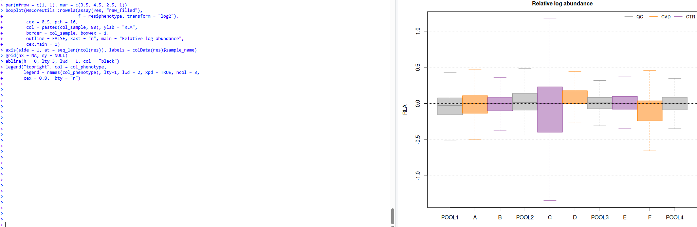

RLA plot for the raw data and filled data.

### 2. Between sample normalisation

median scaling
we compare the median signal of every sample to the grand median of the entire dataset.

-   we will create a **normalization factor (`nf_mdn`)** for each sample.
    
-   By dividing raw abundances by these factors, we force every sample to align to the same "average" signal baseline.

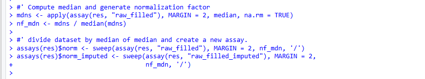
storing both the imputed and non-imputed data within the same `SummarizedExperiment` object

### 3. Assessing overall effectiveness of the normalization approach

Iby comparing the distribution of the log2 transformed feature abundances before and after normalization we evaluate the effectiveness of the normalization process. 

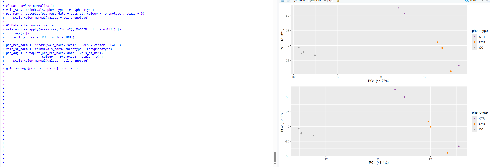
normalization didnt have noticeable impact between PC1 & PC2

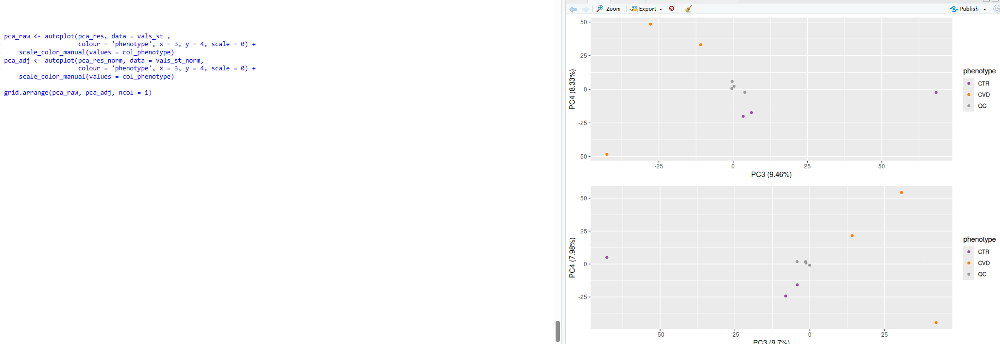

the separation of the study groups on PC3 seems to be better and difference between QC samples lower after normalization

**observation** The separation between the study and QC samples remains the same after the normalization. <-- expected  as normalization should not correct for biological variance but only technical.

Additionally, the RLA plots can be used -> check the reproducibility between groups 

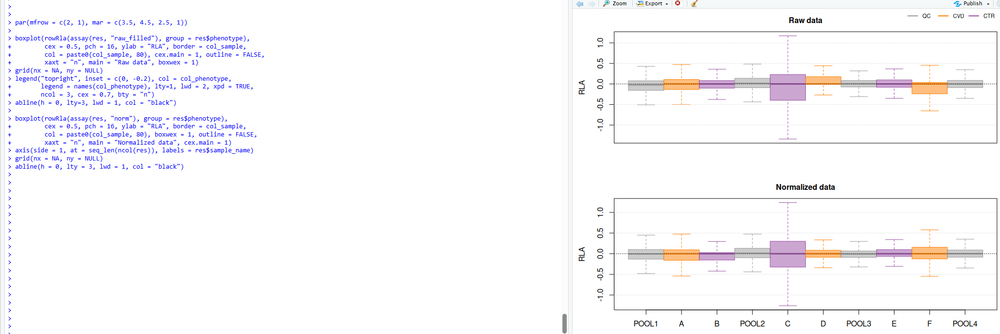

RLA plot before and after normalization. The normalization process has effectively centered the data around the median and medians for all samples are now closer to zero.

### 2. Between sample normalisation

median scaling
we compare the median signal of every sample to the grand median of the entire dataset.

-   we will create a **normalization factor (`nf_mdn`)** for each sample.
    
-   By dividing raw abundances by these factors, we force every sample to align to the same "average" signal baseline.

storing both the imputed and non-imputed data within the same `SummarizedExperiment` object

### 3. Assessing overall effectiveness of the normalization approach

Iby comparing the distribution of the log2 transformed feature abundances before and after normalization we evaluate the effectiveness of the normalization process. 

normalization didnt have noticeable impact between PC1 & PC2

the separation of the study groups on PC3 seems to be better and difference between QC samples lower after normalization

**observation** The separation between the study and QC samples remains the same after the normalization. <-- expected  as normalization should not correct for biological variance but only technical.

Additionally, the RLA plots can be used -> check the reproducibility between groups 

RLA plot before and after normalization. The normalization process has effectively centered the data around the median and medians for all samples are now closer to zero.

## **Step 4 Quality Control**

By applying the **Dratio (Dispersion Ratio)** ([Broadhurst et al. 2018](https://rformassspectrometry.github.io/Metabonaut/articles/a-end-to-end-untargeted-metabolomics.html#ref-broadhurst_guidelines_2018)) filter, we shift from a dataset that was "statistically complete" (post-imputation) to one that is biologically reliable. and meaningful

additionally , Repeatedly measured QC samples typically serve as a robust basis for cleansing datasets allowing to identify features with excessively high noise so we will use them

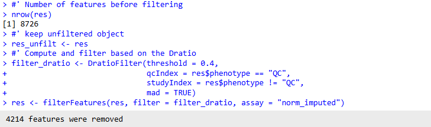

By setting a threshold of 0.4, the noise (measured in QCs) must be less than 40% of the biological variance (measured in your study samples).

The dataset was reduced from 8724 to 4518 most reliable features. 

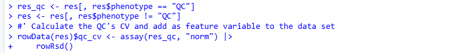
storing QC samples in a separate object for later use and calculate the CV of the QC samples and add that as an additional column to the `[rowData()](https://rdrr.io/pkg/SummarizedExperiment/man/SummarizedExperiment-class.html)` of our result object to be used later as in significant feature

## Step 5 Overlapping features

to understand how these features are distributed across your samples.

"Are the same metabolites being detected in all samples, or is there a subset that is unique to specific biological conditions? "This analysis confirms the **representativeness** of data.

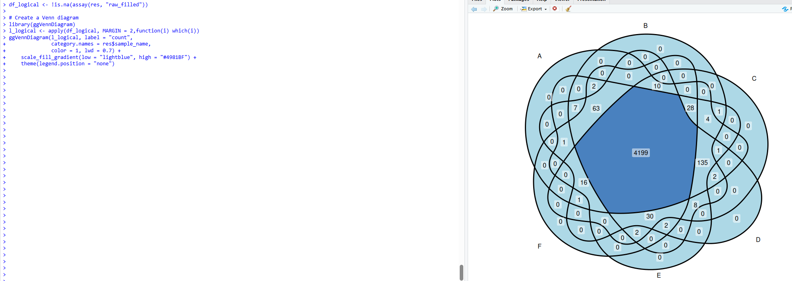
**Venn Diagrams:** Excellent for a small number of groups (3 or fewer). They give an immediate, intuitive sense of "overlap" and "uniqueness" (the exclusive sets). However, above 4, 5, or 6 groups, a Venn diagram becomes messy and can be replaced by Upset diagram

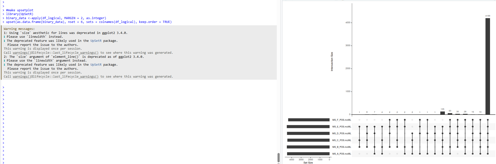
-   The **horizontal bars** on the left show the total number of features detected in each individual sample.
    
-   The **vertical bars** on top show the number of features shared by specific combinations of samples (the intersections).
    
-   This allows to instantly spot if a specific group of samples is missing a large chunk of features compared to the others.

We are looking for two things?
-   **The "Core" Metabolome:** These are the features that appear in _all_ samples.
-   **Condition-Specific Markers:** If features that appear in all "CVD" samples but are completely absent in "CTR" samples-->,potentially identified candidate biomarkers for the condition of interest.